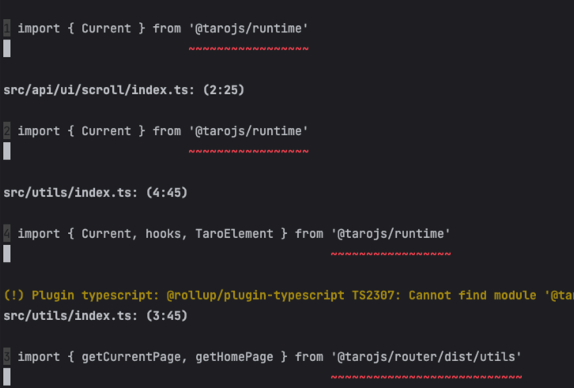
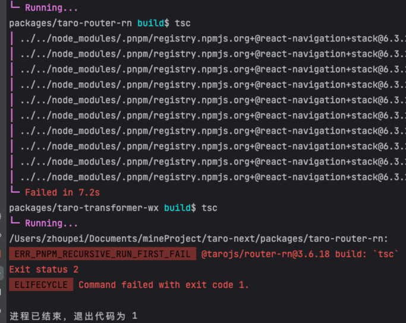

## 介绍：

是一个 Babel 插件，它的作用是**将 Taro API 的调用转换为对应的小程序 API 调用**。

Taro提供了一套类似于React的API，用于开发多端应用。但是，不同的小程序端有不同的 API，因此 Taro 需要将 Taro API 转换为对应的小程序
API。
```babel-plugin-transform-taroapi``` 就是用来完成这个转换的插件。

## 使用：

### 1. 安装

> npm install --save-dev babel-plugin-transform-taroapi

### 2. 用法

```JSX
// .babelrc
{
  "plugins": ["babel-plugin-transform-taroapi", {
    packageName, // 举例 '@tarojs/taro-h5'
    definition,
  }]
}
```

### 3. 示例

```javascript
import Taro, { setStorage } from '${packageName}';
setStorage()
export { Taro }

// ⬇️ 转换后 ⬇️

import Taro, { setStorage as _setStorage} from '@tarojs/taro-h5';
_getStorage();
export { Taro };
```

## 源码：

### 1. 从__test__开始

*直接运行测试用例，控制台可能会报错，原因是依赖的包，没有安装，通过控制台，不断的去寻找对应的包，去执行```pnm run build```即可;
在运行的时候，会遇到一些代码报错，基本上把报错的地方加一下@ts-ignore就没问题了。*

>
> 本来通过最外层的pnpm run build，应该是能给所有包进行build操作的，但不知道为什么一直抱一个tsc的错误，先放着，不影响阅读进度
> T=T



#### i. 核心函数：babelTransform

```javascript
// 核心就是看导出的 plugin 工作流程
import plugin from '../src'
import * as definition from '@tarojs/plugin-platform-h5/dist/definition.json'

const packageName = '@tarojs/taro-h5'
const babelTransform = (code = '') => babel.transform(code, {
  ast: true, configFile: false, plugins: [[
    plugin,
    {
      packageName,
      definition,
    }
  ]]
})

const result = babelTransform(code)
expect(result?.code).toMatchSnapshot()
```

#### ii. 功能演示

> 1）验证插件是否能够正确地处理已实现的 Taro API

```javascript
// 这个测试用例期望插件能够正确地将 Taro.initPxTransform 转换为其他形式，而不是保持不变
import Taro, { setStorage, initPxTransform, param } from '${packageName}';

initPxTransform(param)
Taro.initPxTransform()
Taro.initPxTransform()
Taro['getStorage']()
setStorage()
export { Taro }

// ⬇️ 转换后 ⬇️

import Taro, {
  setStorage as _setStorage,
  initPxTransform as _initPxTransform,
  getStorage as _getStorage
} from '@tarojs/taro-h5';

_initPxTransform(Taro.param);
_initPxTransform();
_initPxTransform();
_getStorage();
_setStorage();
export { Taro };
```

> 2）验证插件是否能够正确地处理未实现的 Taro API

```javascript
// 在这个测试用例中，代码导入了 Taro，然后调用了 Taro.noop，但是 Taro.noop 在 @tarojs/taro-h5 中并不存在。
// 这个测试用例期望插件能够正确地将 Taro.noop 保持不变，而不进行任何转换。
import Taro from '${packageName}'

Taro.noop

// ⬇️ 转换后 ⬇️

import Taro from '@tarojs/taro-h5';

Taro.noop;
```

> 3）验证插件是否能够正确地将 Taro 的静态 API 移动到 Taro 对象下

```javascript
import { noop } from '${packageName}';

noop;
noop();

// ⬇️ 转换后 ⬇️

import Taro from '@tarojs/taro-h5';

Taro.noop;
Taro.noop();
```

> 4）验证插件是否能够正确地避免重复导入 Taro

```javascript
import { Component } from '${packageName}';
import Taro from '${packageName}';

Component
Taro.createAnimation()
Taro.initPxTransform()

// ⬇️ 转换后 ⬇️

import Taro, { createAnimation as _createAnimation, initPxTransform as _initPxTransform } from '@tarojs/taro-h5';

Taro.Component;
_createAnimation();
_initPxTransform();
```

> 5）验证插件是否能够正确地保留左侧赋值语句

```javascript
import Taro from '${packageName}'

let animation
animation = Taro.createAnimation({
  transformOrigin: "50% 50%",
  duration: 1000,
  timingFunction: "ease",
  delay: 0
});
Taro.request()
Taro.request = ''
Taro['request'] = ''

// ⬇️ 转换后 ⬇️

import Taro, { createAnimation as _createAnimation, request as _request } from '@tarojs/taro-h5';

let animation;
animation = _createAnimation({
  transformOrigin: "50% 50%",
  duration: 1000,
  timingFunction: "ease",
  delay: 0
});
_request();
Taro.request = '';
Taro['request'] = '';
```

> 6）验证插件是否能够正确地支持导入的重命名

```javascript
import { Component as TaroComponent } from '${packageName}';

export class Connected extends TaroComponent {
}

// ⬇️ 转换后 ⬇️

import Taro from '@tarojs/taro-h5';

export class Connected extends Taro.Component {
}
```

> 7）验证插件是否能够正确地处理 canIUse 方法

```javascript
import Taro from '${packageName}'

function canIUse() {
}

Taro.canIUse('showToast.object.image')
Taro['canIUse']('showToast.object.image')
canIUse('showToast.object.image')

// ⬇️ 转换后 ⬇️

import Taro from '@tarojs/taro-h5';

function canIUse() {
}

false;
false;
canIUse('showToast.object.image');
```

可以看到，插件的核心功能就是将Taro的API转换成对应平台的API

### 2. 深入到源码：src/index.ts

其实整个ts文件，就是为了提供了一个插件给babel：plugin

```javascript
babel.transform(code, {
  ast: true, configFile: false, plugins: [
    [plugin, {
      packageName,
      definition,
    },
    ],
  ]
});
```

#### i. 具体看看这个插件做了啥：

依旧是返回了一个babel插件对象：

```typescript
return {
  name: 'babel-plugin-transform-taro-api',
  pre() { // 前置处理
    const {
      apis = new Set<string>(),
      bindingName = 'Taro',
      packageName = '@tarojs/taro-h5',
      definition = {},
    } = opts; // 1. 获取对应平台的api、组件定义
    this.definition = {
      ...definition.apis,
      ...definition.components,
      [this.canIUse]: '*',
    };
    this.apis = apis; // 2. 赋值到插件对象中
  },
  visitor: { // 分别对不同的AST类型做处理
    ImportDeclaration(ast) { // 对import语句的处理
      /*
      * 1. 简单校验，导入的包和packageName是否一致
      * 例如：import a from 'xxx';
      * 'xxx' 是否等于 '@tarojs/taro-h5'
      */
      if (ast.node.source.value !== this.packageName) return;
      // 2. 解析import的变量，例：import { defineComponent, ref } from 'vue' 中的 defineComponent 和 ref。
      ast.node.specifiers.forEach((node) => {
        if (node是默认导入) { // 2.1 例如： import Taro from '@tarojs/taro-h5';则为true
          needDefault = true; // a. 标志需要默认导入
        }
        if (导入标志符) { // 2.2 例如： import { defineComponent } from 'vue';则为true
          if (this.apis中存在) { // a. 如果该标志符在对应平台已经实现
            ast.scope.rename(node.local.name); // b. 进行转换
            invokedApis.set(propertyName, node.local.name); // c. 并作标记
          } else { // 2.3 若是仍未实现的API，则修改为Taro.xx
            needDefault = true; // a. 并标记需要默认导入Taro
            referTaro.push(idn); // 记录需要引入的Taro
            /**
             * 下面这段代码的作用是：为了解决 Taro API 的转换问题
             * 在 Taro 中，有一些 API 是通过全局变量 Taro 暴露的，例如 Taro.showToast。
             * 但在转换过程中，我们希望将这些全局变量的引用替换为一个新的表达式，以避免污染全局作用域。
             * 举例说明：
             * import Taro from '@tarojs/taro-h5';
             * Taro.showToast()
             * ⬇️ 转换后 ⬇️
             * import { showToast } from '@tarojs/taro-h5';
             * showToast()
             */
            binding && binding.referencePaths.forEach(reference => {
              reference.replaceWith(
                t.memberExpression(
                  idn,
                  t.identifier(propertyName),
                ),
              );
            });
          }
        }
      });
    },
    MemberExpression(ast) { // 成员属性访问，例如：Taro.xx、Taro['xx']
      // 1. 判断是否是Taro
      // 2. 兼容Taro的多种调用形式，比如：Taro['xxx'](xxx)
      // 3. 对同一个api调用多次的处理
      if (this.apis.has(propertyName)) { // 如果是h5已实现的api
        if (!isAssignment) { // a. 是否赋值表达式
          if (invokedApis.has(propertyName)) { // b. 已经被调用过
            // b.1 获取对应端已经实现的api，直接获取
            invokedApis.get(propertyName);
          } else { // c. 第一次调用，set记录
            invokedApis.set(propertyName, newPropertyName);
          }
        }
      } else { // 未实现的api
        needDefault = true; // 标记需要默认导入
      }
    },
    CallExpression(ast) { // 函数调用处理，例如：Taro.xx()、Taro['xx']()
      // 1. 检查当前环境是否支持该函数调用，不支持直接返回，节省性能
      if (!ast.scope.hasReference(this.canIUse)) return;
    },
    Program: {
      enter(ast) {
        needDefault = false; // 初始化
        referTaro = []; // 初始化
        invokedApis.clear(); // 初始化
      },
      exit(ast) {
        // 防止重复引入
        // 再次遍历ast
        ast.traverse({
          ImportDeclaration(ast) {
            if (未引入taro) {
              isTaroApiImported = true;
            } else { // 重复引入则直接remove
              return ast.remove();
            }
            if (needDefault) { // 是否需要插入Taro
              // 需要则拼接插入Taro
              const defaultImport = t.importDefaultSpecifier(t.identifier(taroName));
              ast.node.specifiers = [
                defaultImport,
                ...namedImports,
              ];
              needDefault = false;
            } else {
              ast.node.specifiers = namedImports;
            }
          },
        });
      },
    },
  },
};
```

#### ii. 重点

##### a. needDefault标记的作用

> 为了判断最终是否需要引入Taro
